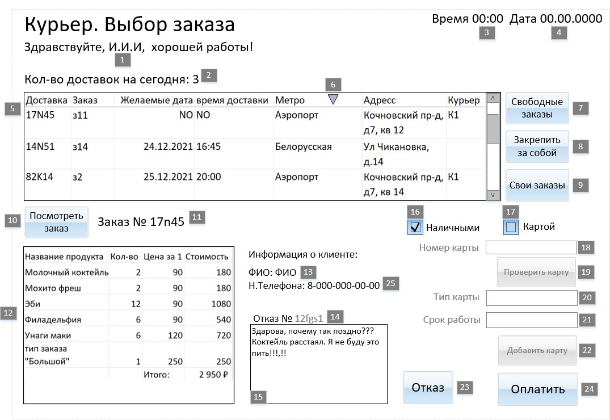

# Спецификация пользовательского интерфейса курьера

> Цель: документирование элементов UI и их взаимодействия с базой данных.

---

## 🎯 Общее описание

Интерфейс предназначен для курьера, который работает с заказами:
- Выбирает свободный заказ
- Закрепляет его за собой
- Просматривает состав заказа
- Подтверждает доставку или оформляет отказ
- Работает с оплатой (наличные / карта)

---

## 🖼️ Макет интерфейса



---

## 🧱 Элементы интерфейса

| ID | Тип элемента | Что делает |
|----|--------------|------------|
| 5  | DataGrid     | Отображает список свободных заказов. Запрос к таблице `Доставка`. Можно выбрать строку для дальнейших действий. |
| 11 | TextBox      | Выводит номер заказа (`Заказ.НомЗакоза`) |
| 12 | DataGrid     | Отображает состав заказа через запрос к `ЗаказПродукт`. Показывает название, количество и цену продукта. |
| 13 | TextBox      | Выводит ФИО клиента (`Клиент.ФИО`) |
| 14 | TextBox      | Выводит номер возврата (`Отказ.НомВозвр`) |
| 15 | EditBox      | Поле ввода причины отказа (`Отказ.Причина`) |
| 18 | EditBox      | Ввод номера карты (`Карта.Номер`) |
| 20 | EditBox      | Ввод/вывод типа карты (`Карта.Тип`) |
| 21 | EditBox      | Ввод/вывод срока действия карты (`Карта.Срок`) |
| 25 | TextBox      | Дублирует ФИО клиента (`Клиент.ФИО`) |

---

## 🔘 Управляющие элементы

| ID | Название             | Тип    | Триггер     | Описание |
|----|----------------------|--------|-------------|----------|
| 0  | Интерфейс            | Форма  | Загрузка    | При открытии формы загружаются константы и исходные данные. |
| 7  | Свободные заказы     | Кнопка | Нажатие     | Обновляет `DataGrid 5` — показывает список доставок, где `ТабНом = NULL`. |
| 8  | Закрепить за собой   | Кнопка | Нажатие     | В выбранной записи обновляется поле `ТабНом` на значение текущего курьера. |
| 9  | Свои заказы          | Кнопка | Нажатие     | Показывает список доставок, где `ТабНом = текущий курьер`. |
| 10 | Посмотреть заказ     | Кнопка | Нажатие     | Загружает данные по выбранному заказу: состав, клиент, стоимость. |
| 16 | Наличными            | Флаг   | Нажатие     | Блокирует работу с полями `18–22` (работа с картой). |
| 17 | Картой               | Флаг   | Нажатие     | Разблокирует работу с полями `18–22`. |
| 19 | Проверить карту      | Кнопка | Нажатие     | Проверяет наличие записи в таблице `Карта` по номеру. Если карта найдена — заполняет поля `20`, `21` и блокирует `22`. Иначе — очищает их и разблокирует `22`. |
| 22 | Добавить карту       | Кнопка | Нажатие     | Создаёт новую запись в таблице `Карта` на основе данных из `18`, `20`, `21`. |
| 24 | Оплатить             | Кнопка | Нажатие     | Создаёт запись в таблице `Оплата`. Обновляет `Заказ`, привязывая к нему оплату. |
| 23 | Отказ                | Кнопка | Нажатие     | Создаёт запись в таблице `Отказ`. Записывает причину из `15`. Отображает `TextBox 14`. |

---

## 📊 Связь элементов с базой данных

| Элемент | Таблица         | Атрибут           |
|--------|------------------|--------------------|
| 5      | Доставка        | НомДост, СтатусДост, Адрес |
| 11     | Заказ           | НомЗакоза          |
| 12     | ЗаказПродукт    | Название, Кол-во, Цена |
| 13     | Клиент          | ФИО                |
| 14     | Отказ           | НомВозвр           |
| 15     | Отказ           | Причина            |
| 18     | Карта           | Номер              |
| 20     | Карта           | Тип                |
| 21     | Карта           | Срок действия      |
| 25     | Клиент          | ФИО                |

---

## 🔄 Пример бизнес-логики

### ➤ Проверка наличия карты (кнопка ID 19)

#### Шаги:
1. SQL-запрос:
   ```sql
   SELECT * FROM Карта WHERE Номер = [значение из EditBox 18]
